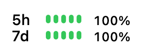

<h1 align="center">Codexbar Lite</h1>

<p align="center">Your Codex quota. A glance away.</p>

<p align="center">
  <a href="https://github.com/abinzzz/codexbar-lite/releases/latest"></a>
  <a href="https://github.com/abinzzz/codexbar-lite/actions/workflows/ci.yml"></a>
  <a href="LICENSE"></a>
</p>

<p align="center">
  <a href="#install">Install</a> ·
  <a href="docs/USAGE.md">User guide</a> ·
  <a href="https://github.com/abinzzz/codexbar-lite/releases">Releases</a>
</p>

<br>

<p align="center">
  <picture>
    <source media="(prefers-color-scheme: dark)" srcset="docs/demo-dark.gif">
    
  </picture>
</p>

<p align="center"><sub>5h: 100% → 0% &nbsp;·&nbsp; 7d: 100% → 85%<br>Illustrative demo at 3× size. Actual quota windows vary independently.</sub></p>

<br>

A small [SwiftBar](https://github.com/swiftbar/SwiftBar) plugin that keeps your remaining Codex quota in the menu bar. Built for **Apple Silicon Macs running macOS 13 or later**.

- **Know what's left.** Remaining percentages, compact progress bars, and local reset times.
- **Use your existing login.** Connects through the Codex CLI; no separate API key or backend.
- **Keep it simple.** Refreshes every minute. Missing data stays unknown, and setup preserves your other plugins.

## Install

With SwiftBar configured and Codex signed in:

```sh
brew install abinzzz/codexbar-lite/codexbar-lite
codexbar-lite setup
```

Requires current Apple Command Line Tools or Xcode. Homebrew installs Python for you.

<details>
<summary>First time using SwiftBar or Codex?</summary>

```sh
brew install --cask swiftbar codex
codex login
open -a SwiftBar
```

Choose a plugin directory when SwiftBar opens, then run the installation commands above. Use a ChatGPT account that supports Codex quota queries.

</details>

<details>
<summary>Prefer installing from source?</summary>

From the project root, with Python 3.10 or later and Apple development tools installed:

```sh
python3 tools/install.py --prefix "$HOME/.local"
"$HOME/.local/bin/codexbar-lite" setup
```

</details>

## Everyday commands

| Command | What it does |
| :--- | :--- |
| `codexbar-lite status` | Fetch remaining quota as JSON. |
| `codexbar-lite doctor --live` | Check local dependencies and account access. |
| `codexbar-lite menu --demo` | Render a sample without signing in. |
| `brew upgrade codexbar-lite` | Install the latest version. |

To remove the plugin and package:

```sh
codexbar-lite uninstall
brew uninstall codexbar-lite
```

For custom paths, quota colors, and troubleshooting, see the [user guide](docs/USAGE.md).

## Under the hood

Python's standard library handles the local Codex app-server connection. A small Swift/AppKit renderer draws the menu bar image. SwiftBar handles scheduling.

The plugin reuses your Codex CLI login and makes no direct reads of authentication files. It sends no analytics. The Codex CLI connects to its account service to fetch limits.

[Architecture](docs/ARCHITECTURE.md) · [Validation](docs/VALIDATION.md) · [Release guide](docs/RELEASING.md) · [Changelog](CHANGELOG.md)

Run `make check` to build and test on an Apple Silicon Mac. Tests use a fake app-server and require no login.

---

[MIT licensed](LICENSE). An independent community project, unaffiliated with OpenAI or SwiftBar.
