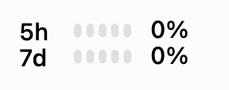
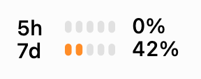
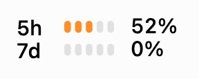

<h1 align="center">Codexbar Lite</h1>

<p align="center">Your Codex quota. A glance away.</p>

<p align="center">
  <a href="https://github.com/abinzzz/codexbar-lite/releases/latest"></a>
  <a href="https://github.com/abinzzz/codexbar-lite/actions/workflows/ci.yml"></a>
  <a href="LICENSE"></a>
</p>

<p align="center">
  <a href="#install">Install</a> ·
  <a href="docs/USAGE.md">User guide</a> ·
  <a href="https://github.com/abinzzz/codexbar-lite/releases">Releases</a>
</p>

<br>

<table align="center">
  <tr>
    <th>Startup</th>
    <th>5h reset</th>
    <th>7d reset</th>
  </tr>
  <tr>
    <td><picture>
      <source media="(prefers-color-scheme: dark)" srcset="docs/startup-dark.gif">
      
    </picture></td>
    <td><picture>
      <source media="(prefers-color-scheme: dark)" srcset="docs/5h-reset-dark.gif">
      
    </picture></td>
    <td><picture>
      <source media="(prefers-color-scheme: dark)" srcset="docs/7d-reset-dark.gif">
      
    </picture></td>
  </tr>
</table>

<p align="center">A lightweight <a href="https://github.com/swiftbar/SwiftBar">SwiftBar</a> plugin that shows your remaining Codex quota and reset times in the macOS menu bar.</p>

<br>

## Install

With SwiftBar configured and Codex signed in:

```sh
brew install abinzzz/codexbar-lite/codexbar-lite
codexbar-lite setup
```

Requires an Apple Silicon Mac running macOS 13 or later, SwiftBar 2.1.1 or later, and current Apple Command Line Tools or Xcode. Homebrew installs Python for you.

<details>
<summary>First time using SwiftBar or Codex?</summary>

```sh
brew install --cask swiftbar codex
codex login
open -a SwiftBar
```

Choose a plugin directory when SwiftBar opens, then run the installation commands above. Use a ChatGPT account that supports Codex quota queries.

</details>

<details>
<summary>Prefer installing from source?</summary>

From the project root, with Python 3.10 or later and Apple development tools installed:

```sh
python3 tools/install.py --prefix "$HOME/.local"
"$HOME/.local/bin/codexbar-lite" setup
```

</details>

## Everyday commands

| Command | What it does |
| :--- | :--- |
| `codexbar-lite status` | Fetch remaining quota as JSON. |
| `codexbar-lite doctor --live` | Check local dependencies and account access. |
| `codexbar-lite menu --demo` | Render a sample without signing in. |
| `brew upgrade codexbar-lite` | Install the latest version. |

Upgrading from 0.1.x? Run `codexbar-lite setup` once after upgrading to enable streaming. Later upgrades keep the same launcher.

To remove the plugin and package:

```sh
codexbar-lite uninstall
brew uninstall codexbar-lite
```

For custom paths, quota colors, and troubleshooting, see the [user guide](docs/USAGE.md).

## Under the hood

Python's standard library handles the local Codex app-server connection. A small Swift/AppKit renderer draws the menu bar image. SwiftBar hosts the streaming plugin, which polls account limits every minute.

The plugin reuses your Codex CLI login and makes no direct reads of authentication files. It sends no analytics. The Codex CLI connects to its account service to fetch limits.

[Architecture](docs/ARCHITECTURE.md) · [Validation](docs/VALIDATION.md) · [Release guide](docs/RELEASING.md) · [Changelog](CHANGELOG.md)

Run `make check` to build and test on an Apple Silicon Mac. Tests use a fake app-server and require no login.

---

[MIT licensed](LICENSE). An independent community project, unaffiliated with OpenAI or SwiftBar.
